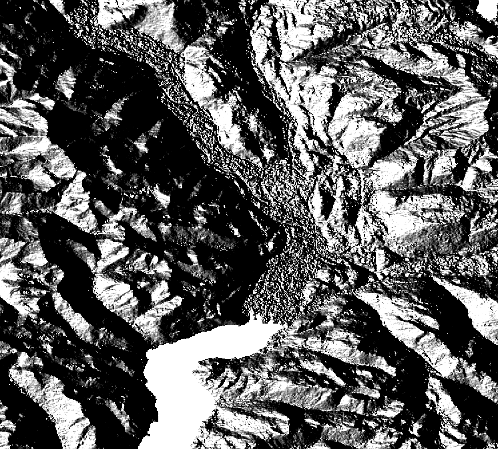
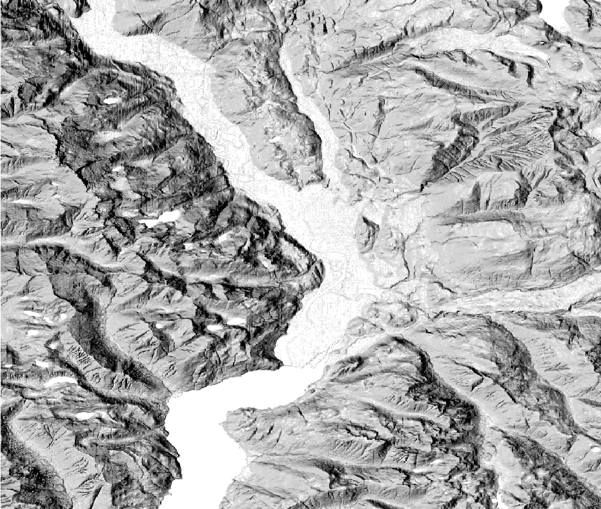

# A Shady Business

Shaded relief and other topographic map making challenges

---

### Overview

- Point 1
- Point 2
- Point 3

---?image=img/squamish-downtown.jpg&size=contain
## Motivation...
Note:
 - Working with friend who has a publishing company and wants to revamp a topo map and hiking guide of the local area that they had made previously.
 - Make a topo map of Squamish from scratch on a limited budget.
 - Squamish in the background - mountainous terrain

---?image=img/OS-Islay.png&size=contain
@snap[north]
### Inspiration
Ordnance survey
@snapend
Note:
- National mapping agency in UK
- Always like the level of detail on the map and the ability of the contours to really highlight the terrain

---?image=img/clarke-garibaldi.jpg&size=contain
@snap[north]
<h3>Inspiration</h3>
Clarke Geomatics
@snapend

---?image=img/bulkley-valley.jpg&size=contain
@snap[north]
<h3>Inspiration</h3>
"Wandering Cartographer" - Bulkley Valley, BC
[https://wanderingcartographer.wordpress.com/](https://wanderingcartographer.wordpress.com/)
@snapend

---

## Data
@ul
- OSM
- Personal GPS traces
- Elevation Data - SRTM vs ASTER
@ulend

Note:
- OSM for majority of vector data
- Supplemented with some GPS traces from personal trips
- Elevation data needed to be freely available
---

@snap[north]
<h2>Elevation Data</h2>
@snapend

ASTER

@snapend

SRTM

Note:
- Shuttle Radar Topography Mission.
- Advanced Spaceborne Thermal Emission and Reflection Radiometer

---?image=img/original-srtm-zoomed.png&size=contain
### SRTM

---

<iframe onload="this.width=screen.width;this.height=screen.height;" data-src="https://mapzen.com/documentation/terrain-tiles/"></iframe>
@title[Mapzen]

Note:
- Could have gone to NASA Earth Explorer to get individual DEM files which are divided up arbitrarily and then mozaiced them back together
- MapZen elevation tiles NextZen elevation tiles

---
Terrain Sculptor
- v memory hungry - I had it maxing out this 16gb macbook pro to get it done.
- Mention

Add as as multiplier beneath forest cover

Not great... Daniel P huffman

Highlights/lowlights
- Show examples
- Show QGIS UI screenshot

Texture
- Explain what it is

Still didn't look great so I added texture as well

Saw a tutorial by Daniel Huffman on creating shaded relief in Blender

Explain what blender is
Didn't get results that were very useful - issues with producing a georeferenced output and it didn't look great anyway (explain some of wandering cartographer's issues)

James posted an article by the "Wandering Cartographer" which I thought was much more useful - it uses a plugin for blender called Blender GIS and gives more tips on tweaking the output.
What did I find created a good result? - Increasing Z factor to x?

(compare to original SRTM/gdal hillshade)

Replaced original hillshade in map with blender one for highlights/lowlights

Eventually switched to an elevation ramp/gradient

Try Imhof

---?image=img/original-srtm-zoomed.png&size=contain&opacity=40
<h3>SRTM</h3>
@ul
- OSM
- Personal GPS traces
- Elevation Data - SRTM vs ASTER
@ulend

---?image=img/4-render-25pct.jpg&size=contain&position=left
@snap[north]
Blender image
@snapend
