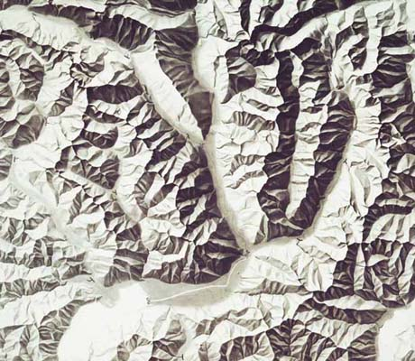
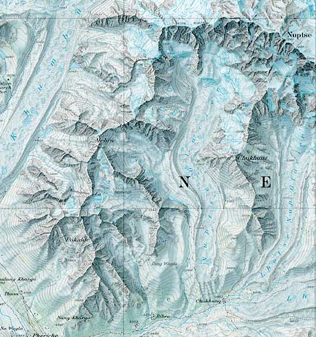

# A Shady Business

Shaded relief and other topographic map making challenges

---

### Overview

- Point 1
- Point 2
- Point 3

---?image=img/squamish-downtown.jpg&size=contain
## Motivation...
Note:
 - Working with friend who has a publishing company and wants to revamp a topo map and hiking guide of the local area that they had made previously.
 - Make a topo map of Squamish from scratch on a limited budget.
 - Squamish in the background - mountainous terrain

---?image=img/OS-Islay.png&size=contain
@snap[north]
### Inspiration
Ordnance survey
@snapend
Note:
- National mapping agency in UK
- Always like the level of detail on the map and the ability of the contours to really highlight the terrain

---?image=img/clarke-garibaldi.jpg&size=contain
@snap[north]
<h3>Inspiration</h3>
Clarke Geomatics
@snapend

---?image=img/bulkley-valley.jpg&size=contain
@snap[north]
<h3>Inspiration</h3>
"Wandering Cartographer" - Bulkley Valley, BC
[https://wanderingcartographer.wordpress.com/](https://wanderingcartographer.wordpress.com/)
@snapend

---

## Data
@ul
- OSM
- Personal GPS traces
- Elevation Data - contours + shaded relief
    - SRTM, ASTER, other sources
@ulend

Note:
- OSM for majority of vector data
- Supplemented with some GPS traces from personal trips
- Elevation data needed to be freely available (to create contours and shaded relief)
- Shuttle Radar Topography Mission.
- Advanced Spaceborne Thermal Emission and Reflection Radiometer

---
@snap[north]
<h3>Shaded Relief</h3>
@snapend

@snap[south]
@size[0.3em](School wall map 1:100,000 and school map 1:250,000 “Graubünden” (Canton of Grisons) (Ticino section) by Eduard Imhof and Heinz Leuzinger 1963.)
@snapend

@snap[south]
@size[0.3em](“Mount Everest” (section) © National Geographic Society, original scale 1:50,000 (size 60 x 93 cm), 1988.)
@snapend

Note:
- According to wikipedia: Shaded relief (aka hill-shading) shows the shape of the terrain in a realistic fashion by showing how the three-dimensional surface would be illuminated from a point light source

---?image=img/original-aster.png&position=left&size=60% auto
@snap[east]
<h4>Elevation Data</h4>
@snapend
Note:
- This example is aster. Not great results initially - too rough
---

<iframe onload="this.width=screen.width;this.height=screen.height;" data-src="https://mapzen.com/documentation/terrain-tiles/"></iframe>
@title[Mapzen]

Note:
- Could have gone to NASA Earth Explorer to get individual DEM files which are divided up arbitrarily and then mozaiced them back together
- MapZen elevation tiles NextZen elevation tiles

---

### Initial GDAL Output

@ul
- `gdaldem hillshade input.tif output_hillshade.tif -of GTiff -az 260.0 -alt 25.0`
- `combined` flag: a combination of slope and oblique shading
- `multidirectional` flag: a combination of hillshading illuminated from 225 deg, 270 deg, 315 deg, and 360 deg azimuth
@ulend

Note:
- For scale, that area is about 37km from top to bottom

---?image=img/original-srtm-zoomed.png&size=contain
@snap[north]
<h4>A closer look</h4>
@snapend

Note:
- Chief is about 2km long

---
Terrain Sculptor
- v memory hungry - I had it maxing out this 16gb macbook pro to get it done.
- Mention

Add as as multiplier beneath forest cover

Not great... Daniel P huffman

Highlights/lowlights
- Show examples
- Show QGIS UI screenshot

Texture
- Explain what it is

Still didn't look great so I added texture as well

Saw a tutorial by Daniel Huffman on creating shaded relief in Blender

Explain what blender is
Didn't get results that were very useful - issues with producing a georeferenced output and it didn't look great anyway (explain some of wandering cartographer's issues)

James posted an article by the "Wandering Cartographer" which I thought was much more useful - it uses a plugin for blender called Blender GIS and gives more tips on tweaking the output.
What did I find created a good result? - Increasing Z factor to x?

(compare to original SRTM/gdal hillshade)

Replaced original hillshade in map with blender one for highlights/lowlights

Eventually switched to an elevation ramp/gradient

Try Imhof

@snap[north]
<h2>Elevation Data</h2>
@snapend

ASTER

@snapend

SRTM

